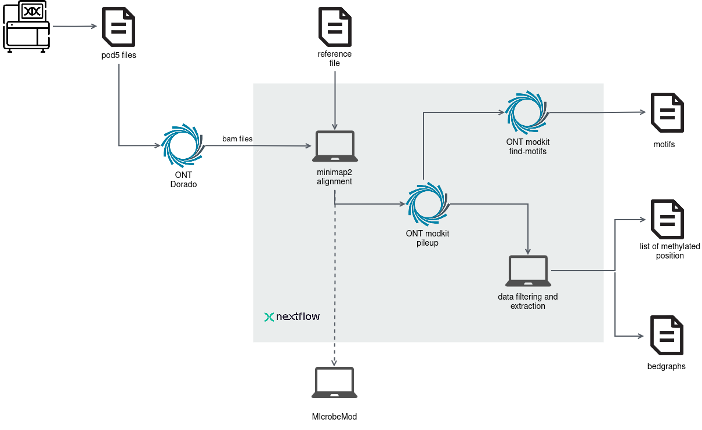

# Nextflow Pipeline for Bacterial Methylated Positions and Motif Extraction from ONT Data

This pipeline processes basecalled reads generated by **Dorado**, with DNA modification basecalling required. It extracts methylated positions along a reference genome and identifies specific motifs using **Modkit**.

Schematic overview of the pipeline:



## Inputs

- **Basecalled reads**:  Outputs from Dorado in BAM file format, which include basecalled DNA modifications. See [Basecalling with Dorado](#basecalling-with-dorado) for details.
- **Reference file**: A reference genome or sequence against which the reads will be aligned. The assembly obtained from the BAM files is recommended. 

## Outputs

- **Motif analysis with Modkit**: Identified motifs based on DNA modifications using Modkit.
- **Statistical analysis**: Summary statistics of the methylation status for each contig in the genomes.
- **List of methylated positions**: A list of methylated positions relative to the reference genome, including only those with a confidence level above a custom threshold.
- **Bedgraphs for IGV visualization** Both bedgraphs produced by Modkit and custom refined bedgraphs are provided, displaying methylation confidence for each base.


## Requirements

### **Workflow managements and dependencies** 

You need to install [Nextflow](https://www.nextflow.io/docs/latest/install.html) to run the pipeline. To avoid installing the dependencies, using [Docker](https://docs.docker.com/get-started/get-docker/) or [Singularity](https://docs.sylabs.io/guides/3.0/user-guide/installation.html) is strongly recommended. 

Alternatively, the following dependencies can be installed via [conda](https://docs.anaconda.com/miniconda/) 


```bash
  conda create -n ONT_methylation -c bioconda samtools minimap2 biopython python=3.8 pandas
  conda activate ONT_methylation
   ```

Modkit can be installed from the [github repository](https://github.com/nanoporetech/modkit) or via conda as well


```bash
  conda install -c bioconda ont-modkit
   ```


### Basecalling with Dorado 

[Dorado](https://github.com/nanoporetech/dorado) is the official open-source basecaller for Oxford Nanopore reads. To basecall pod5 files, it is strongly recommended to use the v5 models in super high accuracy mode, as these include detection for 6mA, 5mC, and 4mC modifications.

The following command will download the most recent models with super accuracy mode, using the methylation models for 6mA, 4mC and 5mC as well, and run Dorado. 


```bash
dorado basecaller sup,6mA,4mC_5mC <pod5_folder_path> >  results.bam
   ```
   
Alternatively, you can download specific models individually. In this case, you would need to download the basecalling model and the methylation models separately, then modify the Dorado command accordingly:
   

```bash
dorado download --model dna_r10.4.1_e8.2_400bps_sup@v5.0.0
dorado download --model dna_r10.4.1_e8.2_400bps_sup@v5.0.0_6mA@v1
dorado download --model dna_r10.4.1_e8.2_400bps_sup@v5.0.0_4mC_5mC@v1
```

Once the models are downloaded, you can run Dorado using the command below, specifying the basecalling model and adding the methylation models for modified bases:

```bash
dorado basecaller dna_r10.4.1_e8.2_400bps_sup@v5.0.0 <pod5_folder_path> --modified-bases-models dna_r10.4.1_e8.2_400bps_sup@v5.0.0_6mA@v1,dna_r10.4.1_e8.2_400bps_sup@v5.0.0_4mC_5mC@v1  > results.bam
```

#### Using Dorado duplex

Another option is to basecall with Dorado in duplex mode, which has recently been updated to support modification detection.

```bash
dorado duplex sup,6mA,4mC_5mC <pod5_folder_path> >  results.bam
   ```

The dx tag in the BAM record allows you to distinguish between simplex and duplex reads. You can use this tag to filter out redundant reads if desired.

However, it is not yet clear if duplex basecalling offers significant benefits for downstream analysis, as modification calls are still made on only one DNA strand.

## How to Run
To run the pipeline with a single reference and BAM file, use the following command:

```bash
nextflow run main.nf --fasta sample_test.fasta --bam sample_test.bam
   ```
   
- **fasta** specifies the reference genome file in FASTA format.
- **bam** specifies the basecalled BAM file output from Dorado.

If you have multiple references and BAM files, you can provide them using wildcard patterns (*). For example:

```bash
nextflow run main.nf --fasta '*.fasta' --bam '*.bam'
   ```
   
In this case, ensure that the base names of the FASTA and BAM files match exactly. This matching allows the pipeline to correctly associate each reference with its corresponding BAM file.

For complex cases with numerous references and BAM files, you can also use the --list parameter to specify CSV files as input. This approach offers flexibility by allowing each reference and BAM file pair to be listed explicitly.

For example:

```bash
nextflow run main.nf --list --fasta references.csv --bam mappings.csv
   ```
The `references.csv` file should contain the sample name and path to each reference FASTA file:

```csv
sample1,/path/to/reference1.fasta
sample2,/path/to/reference2.fasta
sample3,/path/to/another/reference3.fasta
```

The `mapping.csv` file should list the sample name and path to each BAM file:

```csv
sample1,/path/to/mapping1.bam
sample2,/path/to/mapping2.bam
sample3,/path/to/another/mapping3.bam
```


### Running with Containers

To run the pipeline using Docker, use the following command:
```bash
nextflow run main.nf --fasta sample_test.fasta --bam sample_test.bam -profile docker
   ```

To run the pipeline with SLURM and Singularity, use this command:
```bash
nextflow run main.nf --fasta sample_test.fasta --bam sample_test.bam -profile slurm,singularity
   ```
   

## Results interpretation

### Motifs from Modkit

The results include a table generated by Modkit, named `modkit_motifs_tsv`, which summarizes the detected motifs. It is recommended to compare the detected motifs and their frequencies to determine if the same motif is modified for multiple modifications (also check the reverse complement of the motifs). Note that the code "21839" corresponds to the 4mC modification.


**Important:** Modkit applies a [confidence threshold](https://github.com/nanoporetech/modkit/blob/master/book/src/filtering.md) to filter modified positions. Only bases with a methylation confidence value above this threshold will be considered methylated. You can adjust this value using the `filter_threshold_modkit` parameter. The default is set to 0.75, as values lower than this tend to produce a high number of false positives, while higher values may be overly stringent.

The intermediate output file, `modkit_pileup_output.bed`, is a tab-separated file that summarizes all reference positions along with their aggregated results from individual reads. This file serves as input for the next steps in the analysis.

### Methylation Level Statistics

Methylation statistics are stored in the `methylation_statistics` folder. Separate tables are created for each modification, with the percentage of methylation calculated by dividing the number of methylated bases (those exceeding the Modkit threshold) by the total number of relevant bases (A for 6mA, C for 4mC and 5mC).

### List of Methylated Positions and Bedgraphs for Visualization

To extract the list of likely methylated positions, the output from Modkit (`modkit_pileup_output.bed`) must undergo filtering and refining (see [How Percent modified is computed](#How-percent-modified-is-computed) for more information). The tables containing these lists are located in the `modification_tables` folder.

Only positions with coverage greater than 10 and methylation confidence above the specified threshold are included. This threshold can be adjusted using the parameter `percent_cutoff_modification_table` (default = 0.5).

The bedgraphs generated directly from Modkit can be found in the `bedgraphs` folder, while the preprocessed bedgraphs, which reflect the same values as in the `modification_tables`, are located in the `bedgraphs_customized` folder.

## How Percent Modified is Computed

Modkit pileup aggregates the information from all reads for all positions of the reference genome and computes a value known as "fraction modified," which represents the percentage of reads with a methylated base for each position. This calculation considers only the reads where the base has passed the confidence threshold; thus, if a position has a high number of reads with bases that didn't meet this threshold, those reads are excluded from the count.

In Modkit, "fraction modified" is defined as N~mod~ / N~valid_cov~. In our analysis, we introduce a new metric called "percent modified," computed as: N~mod~ / (N~valid_cov~ + N~fail~ + N~diff~). This approach helps to prevent positions with only a few valid reads from being incorrectly classified as modified.


## Running MicrobeMod

[MicrobeMod](https://github.com/cultivarium/MicrobeMod) is a popular tool for motif annotation and identification. We recommend comparing the results from Modkit (generated using this pipeline) with those obtained from MicrobeMod for a comprehensive analysis.

MicrobeMod requires the user to align the BAM files generated by Dorado to the reference genome. Since this alignment is the first step in our pipeline, you can directly run MicrobeMod using the intermediate file `methylation_mapped.bam` as follows:

```bash
MicrobeMod call_methylation -b <path_to_the_results_folder>/methylation_mapped.bam -r genome_reference.fasta
```
